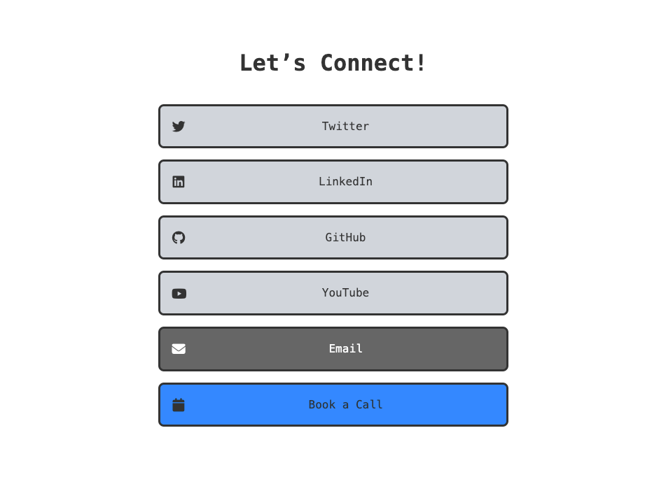

# Astro Biolink Clone by [Leif](https://grains.leifjerami.com)

[](https://app.netlify.com/sites/biolink-clone/deploys)



## See it in action

[biolink-clone.netlify.app](https://biolink-clone.netlify.app)

## Deploy to Production

[](https://app.netlify.com/start/deploy?repository=https://github.com/fishingelephants/biolink-clone)

### Or clone this repo

```sh
git clone https://github.com/fishingelephants/biolink-clone.git biolink
```

```sh
npm install
```

```sh
npm run dev
```

## Folder Structure

Inside of your Astro project, you'll see the following folders and files:

```text
/
├── public/
├── src/
│   └── layouts/
│       └── Layout.astro
│   └── pages/
│       └── index.astro
│       └── bio.md <- your data links here
│   └── styles/
│       └── global.css
└── package.json
```
